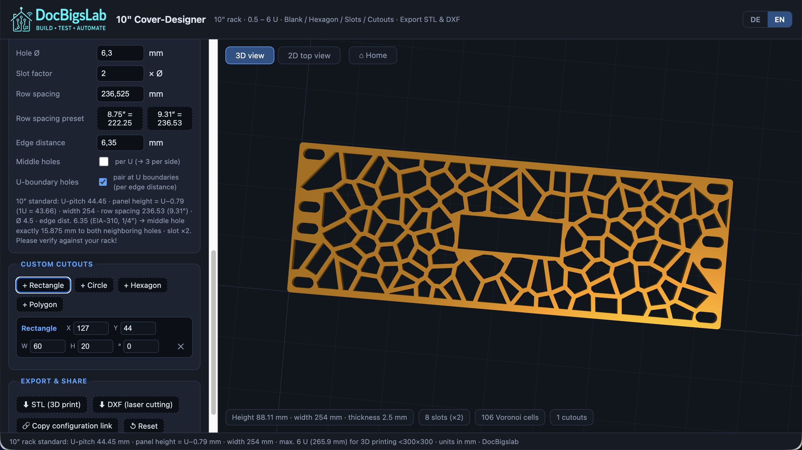

  

# DocBigsLab –  (10") Cover-Designer

[Deutsch](#deutsch) · [English](#english)

## Deutsch

Ein browserbasierter Generator für Abdeckplatten (Blindpanels) für 10"-Racks. Er läuft komplett client-seitig als einzelne HTML-Datei, ohne Server, Build-Prozess oder Installation.

Er erzeugt parametrische Platten mit Lüftungsmustern, individuellen Ausschnitten und normgerechten Montagebohrungen. Export als STL für den 3D-Druck oder als DXF für Laserschnitt und Weiterverarbeitung in CAD.

[Live-Demo](https://docbigs-lab.de/10-cover-designer.html)

### Features

Die Oberfläche ist auf Deutsch und Englisch umschaltbar (oben rechts), die Einstellung wird im Browser gespeichert.

Sechs Lüftungsmuster stehen zur Wahl: Blank, ein Rundloch-Raster, Hexagon (Honeycomb), Lamellen (Längsschlitze), ein organisches Bubble-Muster nach dem Poisson-Disc-Verfahren und ein Voronoi-Rissmuster. Dazu kommen individuelle Ausschnitte in Form von Rechteck, Kreis, Hexagon oder freiem Polygon, die sich per Zahleneingabe oder direkt per Drag & Drop in der 2D-Ansicht platzieren lassen.

Montagebohrungen folgen dem 10"-Rack-Standard (abgeleitet aus EIA-310, U-Pitch 44,45 mm) und werden automatisch mit dem korrekten Rasterabstand von 15,875 / 15,875 / 12,7 mm je U gesetzt – auch bei halben U-Höhen zwischen 0,5 und 5,5 U. Panelgrößen reichen von 0,5 U bis 6 U, wahlweise mit der halben Resthöhe oben oder unten. Ecken lassen sich rund (mit Radius) oder als 45°-Fase ausführen, jeweils bis 5 mm.

Die Vorschau zeigt das Ergebnis live in 2D (SVG) und 3D (three.js, dreh-, zoom- und schwenkbar, mit einem Button zum Zurücksetzen der Ansicht). Fertige Konfigurationen lassen sich über einen URL-Parameter als Link kopieren, versenden oder speichern.

Nach dem ersten Laden läuft die Anwendung offline, bis auf die three.js-Abhängigkeit für die 3D-Ansicht (siehe unten).

### Verwendung

`10-cover-designer.html` in einem modernen Browser öffnen (Chrome, Firefox, Edge, Safari). Größe, Muster, Ausschnitte und Bohrungen lassen sich links im Panel einstellen, das Ergebnis erscheint rechts in der 2D- oder 3D-Vorschau. Zum Schluss STL für den 3D-Druck oder DXF für den Laserschnitt exportieren.

Es braucht keinen Server, kein `npm install` und keine Abhängigkeiten außerhalb der Datei selbst, abgesehen vom CDN-Skript für die 3D-Vorschau.

### Technische Eckdaten

Alle Maße in mm, abgeleitet vom 10"-Rack-Standard:

| Größe | Parameter |
|---|---|
| U-Pitch | 44,45 mm |
| Panelhöhe | `U × 44,45 − 0,79` mm (Fertigungstoleranz) |
| Plattenbreite | 254 mm |
| Randabstand Bohrungen | 6,35 mm (1/4″, EIA-310) |
| Lochraster je U | 15,875 / 15,875 / 12,7 mm |
| Max. Panelgröße | 6 U (265,9 mm), begrenzt durch ein 300×300-mm-Druckbett |

Die Rastermaße sind aus dem EIA-310-Standard abgeleitet und wurden gegen typische 10"-Racks geprüft. Fertigungstoleranzen variieren zwischen Herstellern, daher lohnt sich vor dem Druck oder Schnitt ein Abgleich mit dem eigenen Rack.

### Technologie

Reines HTML, CSS und JavaScript ohne Framework. three.js (r128) übernimmt die 3D-Vorschau und den STL-Export über `ExtrudeGeometry`. SVG-Vorschau, DXF-Export und alle Muster-Berechnungen laufen über eine eigene 2D-Geometrie-Engine, unter anderem mit Sutherland-Hodgman-Polygon-Clipping, Voronoi-Tessellation und Poisson-Disc-Sampling. Es gibt keinen Build-Schritt und keinen Bundler; die einzige Abhängigkeit zum Selberhosten ist das CDN-eingebundene three.js.

### Bekannte Einschränkungen

Die 3D-Vorschau braucht beim ersten Laden eine Internetverbindung, weil three.js von einem CDN geladen wird. Ohne Verbindung fällt die Anwendung automatisch auf eine reine 2D-Ansicht zurück, Export und Berechnungen funktionieren davon unabhängig. Getestet ist das Tool für 10"-Racks; andere Rack-Normen wie 19" werden nicht unterstützt.

### Lizenz

[MIT](LICENSE). Die Software darf frei genutzt, verändert und weiterverteilt werden, auch kommerziell, solange der Copyright-Hinweis erhalten bleibt.

### Autor

[DocBigsLab](https://docbigs-lab.de/) – entwickelt, nicht gebastelt

## English

A browser-based generator for 10" rack blanking panels. It runs entirely client-side as a single HTML file, with no server, build step, or installation required.

It generates parametric panels with ventilation patterns, custom cutouts, and standard-compliant mounting holes. Export as STL for 3D printing or as DXF for laser cutting and further processing in CAD.

[Live demo](https://docbigs-lab.de/10-cover-designer.html)

### Features

The interface can be switched between German and English (top right); the preference is saved in the browser.

Six ventilation patterns are available: blank, a round-hole grid, hexagon (honeycomb), louvers (slots), an organic bubble pattern based on Poisson-disc sampling, and a Voronoi crack pattern. Custom cutouts come as rectangles, circles, hexagons, or free-form polygons, and can be entered numerically or placed directly via drag and drop in the 2D view.

Mounting holes follow the 10" rack standard (derived from EIA-310, U-pitch 44.45 mm) and are spaced automatically to the correct grid of 15.875 / 15.875 / 12.7 mm per U, including half-U heights between 0.5 and 5.5 U. Panel sizes range from 0.5 U to 6 U, with the half-U remainder placed at either the top or bottom. Corners can be round (with a radius) or a 45° chamfer, up to 5 mm.

The preview shows the result live in 2D (SVG) and 3D (three.js, with orbit, zoom, and pan, plus a button to reset the view). A finished configuration can be copied as a link via a URL parameter, sent, or bookmarked.

After the initial load, the tool works offline, aside from the three.js dependency used for the 3D view (see below).

### Usage

Open `10-cover-designer.html` in a modern browser (Chrome, Firefox, Edge, Safari). Size, pattern, cutouts, and mounting holes can be adjusted in the panel on the left, and the result appears on the right in the 2D or 3D preview. Export STL for 3D printing or DXF for laser cutting when done.

No server, no `npm install`, and no dependencies beyond the file itself, aside from the CDN script used for the 3D preview.

### Technical reference

All dimensions in mm, derived from the 10" rack standard:

| Value | Parameter |
|---|---|
| U-pitch | 44.45 mm |
| Panel height | `U × 44.45 − 0.79` mm (manufacturing tolerance) |
| Panel width | 254 mm |
| Hole edge distance | 6.35 mm (1/4″, EIA-310) |
| Hole grid per U | 15.875 / 15.875 / 12.7 mm |
| Max. panel size | 6 U (265.9 mm), limited by a 300×300 mm print bed |

The grid dimensions are derived from the EIA-310 standard and have been checked against typical 10" racks. Manufacturing tolerances vary between vendors, so it's worth verifying against your own rack before printing or cutting.

### Technology

Plain HTML, CSS, and JavaScript, no framework. three.js (r128) handles the 3D preview and STL export via `ExtrudeGeometry`. The SVG preview, DXF export, and all pattern calculations run through a custom 2D geometry engine, including Sutherland-Hodgman polygon clipping, Voronoi tessellation, and Poisson-disc sampling. There's no build step and no bundler; the only dependency for self-hosting is the CDN-loaded three.js.

### Known limitations

The 3D preview needs an internet connection on first load, since three.js is loaded from a CDN. Without a connection, the app falls back to a 2D-only view automatically; export and all calculations work independently of that. The tool is tested for 10" racks; other rack standards such as 19" are not supported.

### License

[MIT](LICENSE). The software may be used, modified, and redistributed freely, including commercially, as long as the copyright notice is retained.

### Author

[DocBigsLab](https://docbigs-lab.de/) – engineered, not hacked together